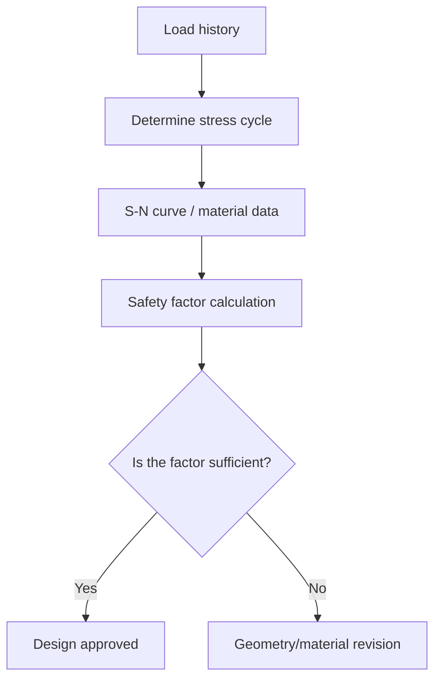

Fatigue concerns the progressive damage that accumulates in a material under repeated loading[^1]. In design, the safety factor and the stress cycle concept take center stage.

```python
import math

def safety_factor(stress, endurance_limit):
    return endurance_limit / stress
```

## Analysis workflow



## References

1. TODO: course note / reference source information to be added.

[^1]: Shigley's Mechanical Engineering Design — fatigue damage and the S-N curve approach.
