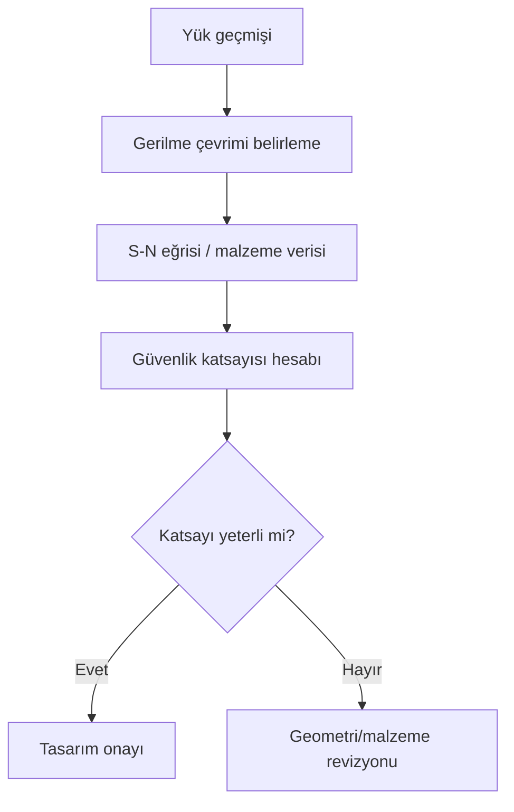

Yorulma, tekrar eden yüklemeler altında malzemede oluşan hasarın sürekliliği ile ilgilidir[^1]. Tasarımda güvenlik katsayısı ve gerilme çevrimi kavramı ön plana çıkar.

```python
import math

def safety_factor(stress, endurance_limit):
    return endurance_limit / stress
```

## Analiz akışı



## Kaynakça

1. TODO: kullanılan ders notu / referans kaynak bilgisi eklenecek.

[^1]: Shigley's Mechanical Engineering Design — yorulma hasarı ve S-N eğrisi yaklaşımı.
